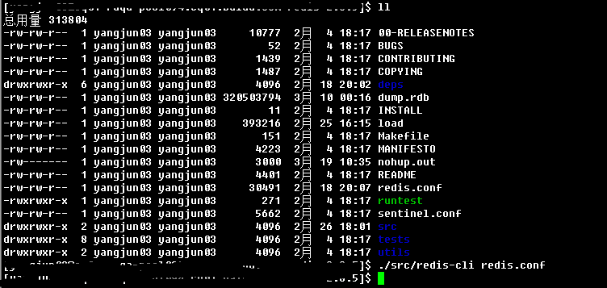

pythonRedisHandle
=================

### Introduction:
a simple example for redis handle with python,which demostrates the redis feature of connection-pool,pipeline,and execute_command.

### Feature:
* demonstrate of connection-pool.
* demonstrate of pipeline.
* demonstrate of execute_command.
    
### UpdateRecords:
* 1.0——base version.
    
### Dependencies:
* redis-server=>>http://www.redis.cn/download.html
* python-redis-client=>>https://pypi.python.org/pypi/redis/2.9.1    
    
### Usage:
* please read the source code directly.     
    
### Screenshots:    
**1.screenshot of starting redis server:**
    

**2.screenshot of test script running:**
     

### Kindly Reminder:
If any questions, please contact JunneYang 597092663@qq.com.

